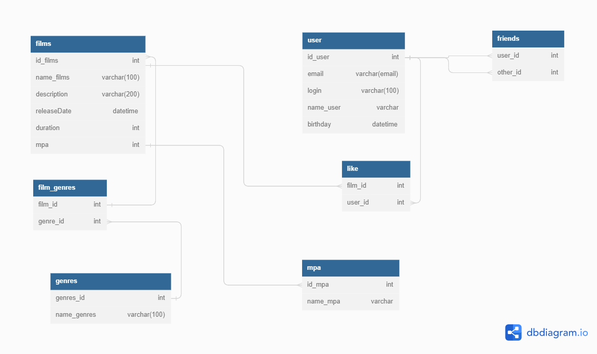

# Диаграмма БД для приложения java-filmorate

### Описание
На данной диаграмме показана структура и связь таблиц в базе данных.

#### *"film"*
Содержит данные о фильмах (название, описание, продолжительность) первичный ключ **film_id**

#### *"rating"*
Содержит данные о рейтинге фильма по возрастной категории. Данная таблица связана с таблицей *"film"* ключом **film_id**

### Примеры запросов к БД

#### Получение списка из 10 фильмов по количеству лайков

SELECT
f.name,  
f.description,  
COUNT(l.user_id) AS quantity_like  
FROM film AS f  
LEFT OUTER JOIN like AS l ON  f.film_id = l.film_id  
GROUP BY f.name  
ORDER BY l.film_id DESC  
LIMIT 10;

#### Получение списка всех пользователей

SELECT*
FROM user    